# Lab Report 4

<br/>


## Set Up

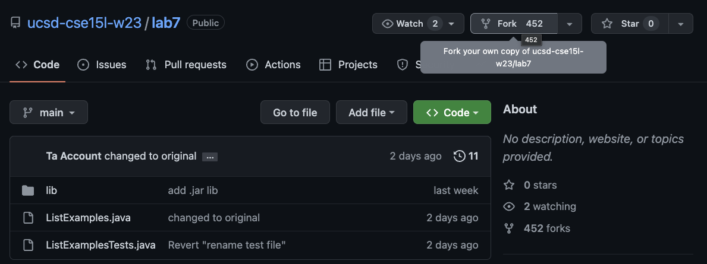

Click here to fork the repo


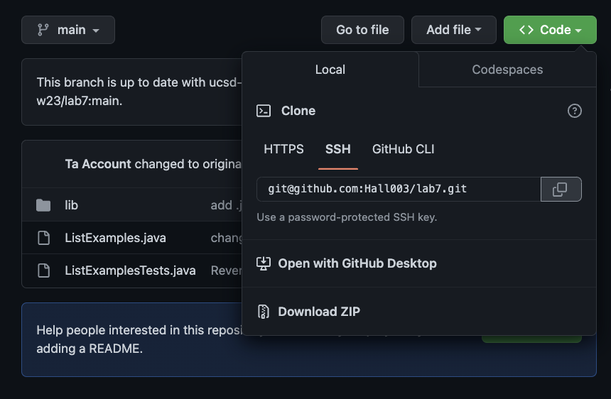

Click on Code and SSH to copy the SSH link

<br/>

Logging in:

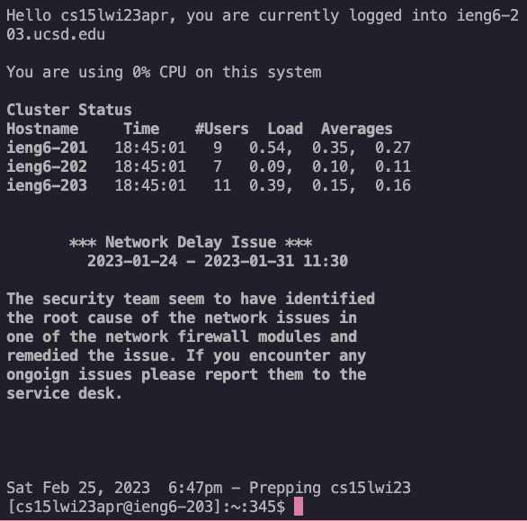

  ``
  ssh cs15lwi23apr@ieng6.ucsd.edu
  ``
  
<br/>

Deleting any existing copies:

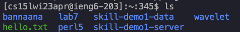
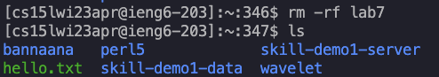

  ``
  rm -rf ~/lab7
  ``
  
<br/>

Cloning the forked repo:

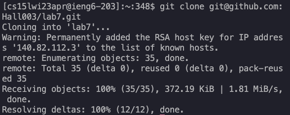

  ``
  git clone git@github.com:Hall003/lab7.git
  ``
  
## Running Tests

<br/>

Changing directory to the cloned repo:


``
cd lab7
``

<br/>

Compiling the java files and running JUnit tests for ListExamplesTests.java:

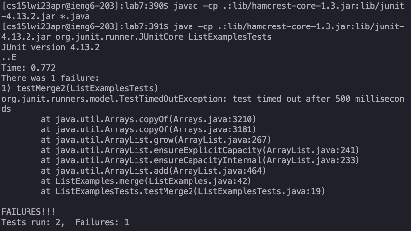

```
javac -cp .:lib/hamcrest-core-1.3.jar:lib/junit-4.13.2.jar *.java

java -cp .:lib/hamcrest-core-1.3.jar:lib/junit-4.13.2.jar org.junit.runner.JUnitCore ListExamplesTests
```

## Identifying and fixing the error:

<br/>

Open the ListExamples.java file to examine:


``
nano ListExamples.java
``

<br/>

Use the arrow keys to go down 42 lines  

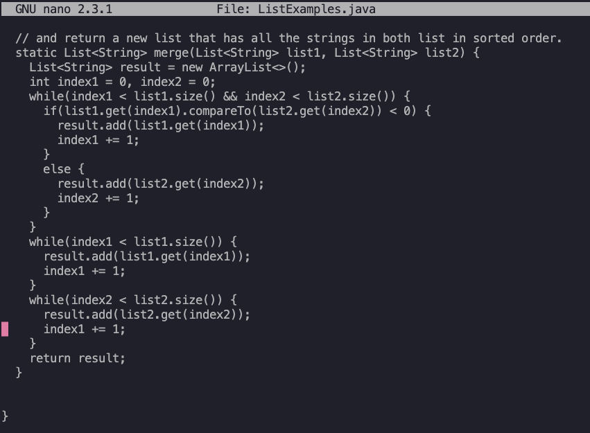

and then 12 spaces to right,

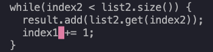

press delete once and replace the 1 with a 2 so that the line reads "index2 += 1;"

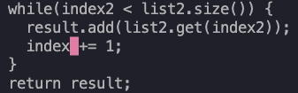
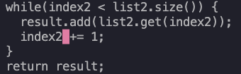

Press control O to save the changes and then control X to exit nano

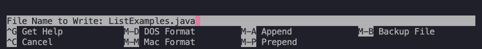

Now we can see that the JUnit tests are all passed:

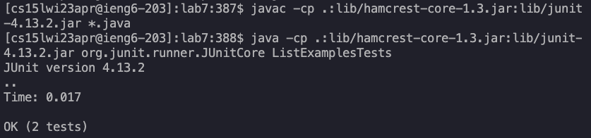

## Committing and pushing to GitHub


First add the files to the commits, then set the commit message, and push to origin


