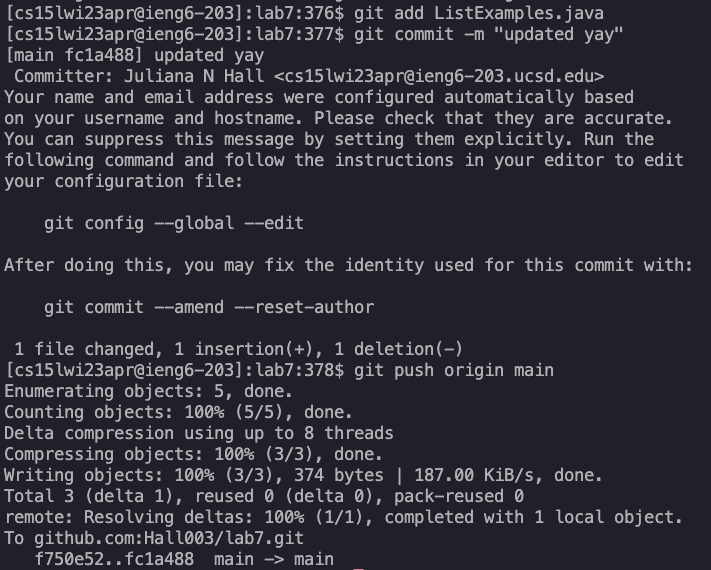

# Lab Report 4

 

## Step 1: Set Up

## Step 2: Click here to fork the repo

## Step 3: Click on Code and SSH to copy the SSH link

 

## Step 4: Logging in by running the following command (XYZ replaced by whatever your log in is)

  ``
  ssh cs15lwi23XYZ@ieng6.ucsd.edu <enter>
  ``

  
 

## Step 5: Deleting any existing copies by runing the follwing command
  
  ``
  rm -rf ~/lab7 <enter>
  ``

ls below is just showing that there was an existing copy and that rm -rf removed the copy

  
 

## Step 6: Cloning the forked repo by running the following command

  ``
  git clone git@github.com:Hall003/lab7.git <enter>
  ``
  

## Step 7: Changing directory to the cloned repo by running the following command

``
cd lab7 <enter>
``
  

## Step 8: The following commands compile the java files and run JUnit tests for ListExamplesTests.java:
  
  ``
javac -cp .:lib/hamcrest-core-1.3.jar:lib/junit-4.13.2.jar *.java <enter>
  ``
  
 ``
java -cp .:lib/hamcrest-core-1.3.jar:lib/junit-4.13.2.jar org.junit.runner.JUnitCore ListExamplesTests <enter>
`` 

## Step 9: Open the ListExamples.java file to examine the error

``
nano ListExamples.java <enter>
``

## Step 10: Scroll to line 43 (it should like the following image)

## Step 11: Press the ``<right>`` arrow key 12 times to move 12 spaces to right

## Step 12: press ``<delete>`` then ``<2>`` to replace the 1 with a 2 so that the line now reads "index2 += 1;"

## Press <Ctrl + O> to save the changes and then <Ctrl + X> to exit nano

## Step 13: Now we can see that the JUnit tests are all passed if we run the following commands again
 
  ``
javac -cp .:lib/hamcrest-core-1.3.jar:lib/junit-4.13.2.jar *.java <enter>
  ``
  
 ``
java -cp .:lib/hamcrest-core-1.3.jar:lib/junit-4.13.2.jar org.junit.runner.JUnitCore ListExamplesTests <enter>
`` 

## Step 14: Committing and pushing to GitHub

First add the files to the commits, then set the commit message, and push to origin

``
git add ListExamples.java <enter>
``

``
git commit -m "<insert commit message>" <enter>
``

``
git push origin main <enter>
``

