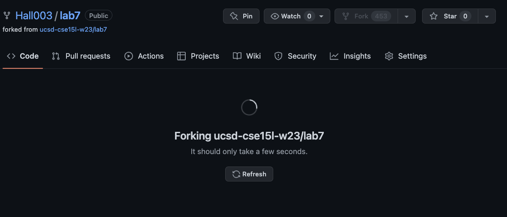

# Lab Report 5

## Optimizing Week 7 Lab and [Lab Report 4](https://hall003.github.io/cse15l-lab-reports/LabReport4.html)

I will be splitting up the bash scripts into two parts, step 1 and step 2. Step 1 covers steps 5 and 6 of our week 7 lab. And Step 2 covers steps 7 through 9 of our week 7 lab. This is to clearly show when the JUnit tests fail and when they succeed after fixing the bug.

### Step 1: Fork the repo

If you already have a copy of lab7 in your github, you will need to delete it.
 
Go to lab7 settings
 

 
Then scroll down to the very bottom of general
 

 
Click on "Delete this repository" and follow the instructions
 

 
Now, you can go back to the repo of lab7 that you were given to clone, [here is the link if you need it](https://github.com/ucsd-cse15l-w23/lab7)
 
Press "fork" and then press "create fork" when prompted
 

### Step 2: Copy the repo link

### Step 3: Remote Log In (XYZ to be replaced by whatever 3-letter combination is in your log in)

Open your terminal and type the following command:
 

``
  ssh cs15lwi23XYZ@ieng6.ucsd.edu <enter>
``

### Step 4: Creating the first Bash Script

For this bash script, we want to combine the command that makes sure that there are no pre-existing copies of 
lab 7 already downloaded, the command that clones lab7 onto the remote machine, and 
the commands that run JUnit tests on lab7
 
 
Run the following command: 
 
``
touch step1.sh <enter>
``
Touch searches for the file and if it's not found, it creates the file.
 
Run the following command:
 
``
nano step1.sh <enter>
``
Nano opens the file so it can be edited.
#### Type out the following code snippets in step1.sh:
Line 1 removes any pre-existing copies of lab7:
 

``
rm -rf ~/lab7 <enter>
``

 
Line 2 clones the repo onto the local machine (the link should be replaced by the link you copied earlier):
 

``
git clone git@github.com:Hall003/lab7.git <enter>
``

 
Line 3 changes the working directory to lab7:
 

``
cd lab7 <enter>
``

 
Line 4 compiles lab7's java files:
 

``
javac -cp .:lib/hamcrest-core-1.3.jar:lib/junit-4.13.2.jar *.java <enter>
``

 
Line 5 runs JUnit tests on ListExamplesTests:
 

``
java -cp .:lib/hamcrest-core-1.3.jar:lib/junit-4.13.2.jar org.junit.runner.JUnitCore ListExamplesTests <enter>
``
 
Press Ctrl+O to save and press Enter to confirm changes
 
Your file should look like this:

 
Then, to exit, press Ctrl+X

### Step 5: Creating the second Bash Script

For this bash script we want to edit the ListExamples.java files, re-run the JUnit tests, and commit then push the
updated file to our forked repo
 
 
Run the following command: 
 
``
touch step2.sh <enter>
``
Touch searches for the file and if it's not found, it creates the file.
 
Run the following command:
 
``
nano step2.sh <enter>
``
Nano opens the file so it can be edited.
#### Type out the following code snippets in step2.sh:

Line 1 changes the working directory to lab7
 

``
cd lab7 <enter>
``

 
Line 2 uses the sed command to edit ListExamples.java to fix the error
 

``
sed -i '43s/index1 += 1;/index2 += 1;/' ListExamples.java <enter>
``

 
Line 3 compiles the java files in lab7
 

``
javac -cp .:lib/hamcrest-core-1.3.jar:lib/junit-4.13.2.jar *.java <enter>
``

 
Line 4 runs JUnit tests on ListExamplesTests
 

``
java -cp .:lib/hamcrest-core-1.3.jar:lib/junit-4.13.2.jar org.junit.runner.JUnitCore ListExamplesTests <enter>
``

 
Line 5 adds ListExamples.java to the staging area
 

``
git add ListExamples.java <enter>
``

 
Line 6 commits the file from the staging area and sets the commit message
 

``
git commit -m "Updated" <enter>
``

 
Line 7 pushes the committed file to the main branch
 

``
git push origin main <enter>
``
 
Press Ctrl+O to save and press Enter to confirm changes
 
Your file should look like this now:

 
Then, to exit, press Ctrl+X

### Step 6: Testing out the scripts

To test step1.sh, type the following command:
 

``
bash step1.sh <enter>
``

 

Here, we can see that lab7 was cloned from the repo and one JUnit test failed.

 

To run step2.sh, type the following command:

 

``
bash step2.sh <enter>
``

  

Here, we can see that all JUnit tests pass and that the fixed file was pushed to main.

 

If we check our repo we can see that the ListExamples.java file has been updated:

 

### Step 7: Logging out

Now that we're done with our task, we can log out of ieng6. To do so, run the following command:
 

``
exit <enter>
``
 

