# Lab Report 1

## Installing VS Code
While you can techincally log into the CSE basement computers from your laptop's terminal, we will be using VS Code for this lab. The first step is to download VS Code, which can be done on [this website](https://code.visualstudio.com/download). 
<br />
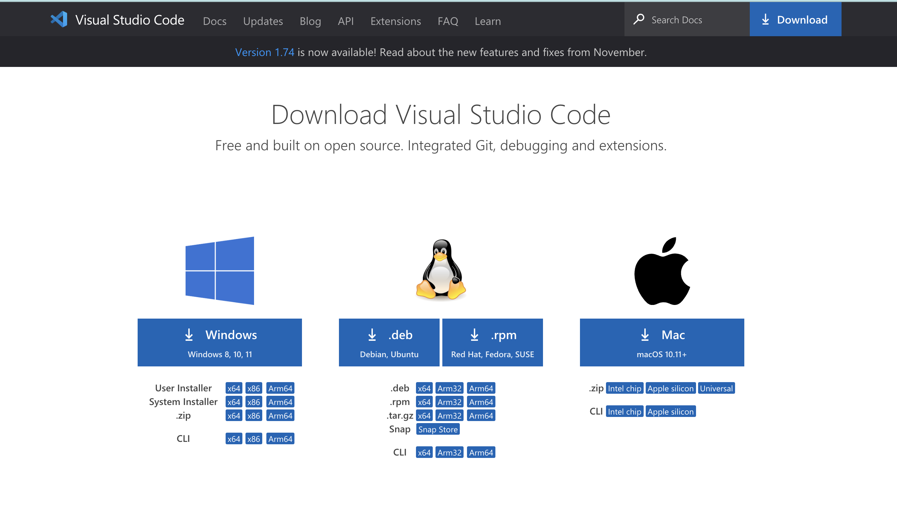
<br />
Select the download option that corresponds with your computer's operating system and follow the instructions to install. 
*Note: There might be more steps, but I downloaded VS Code a while ago and can't remember if there were more steps after installed* It'll look something like this:
<br />
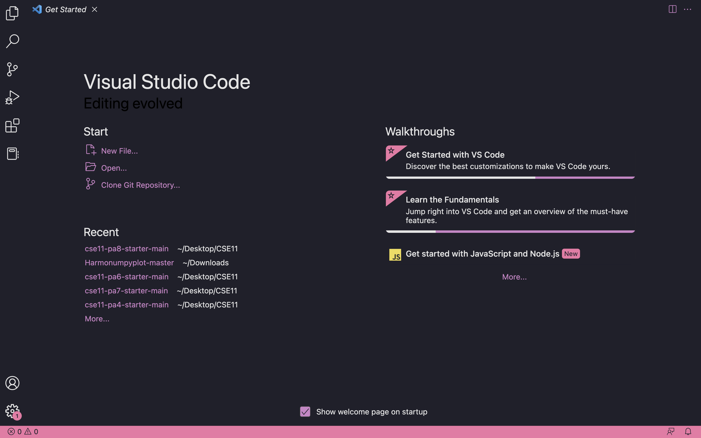 <br />
Once you have VS Code installed on your computer, you'll want to open up a new terminal. 
<br />
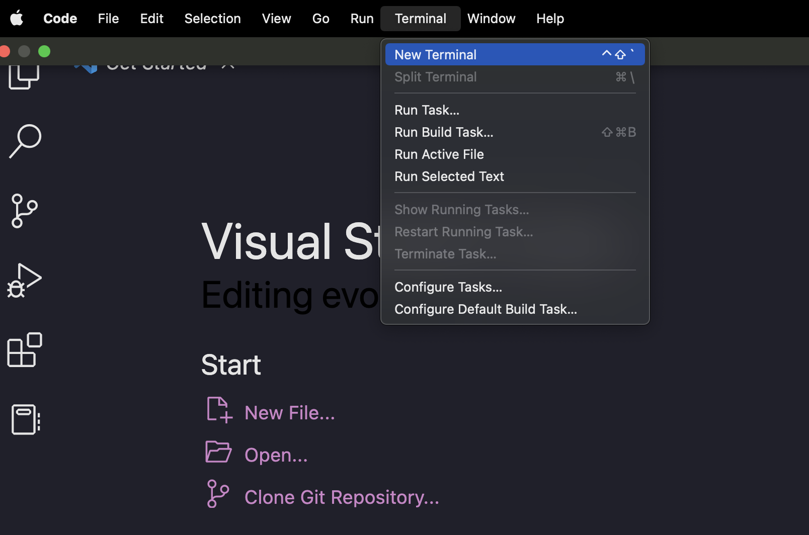 <br />
It should look like this once it's been opened:
<br />
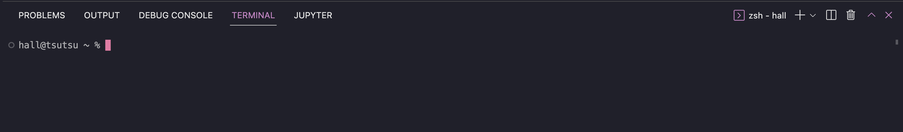 <br />
## Finding your account
Now that we've taken care of opening a new terminal, you'll use this [account lookup tool](https://sdacs.ucsd.edu/~icc/index.php). 
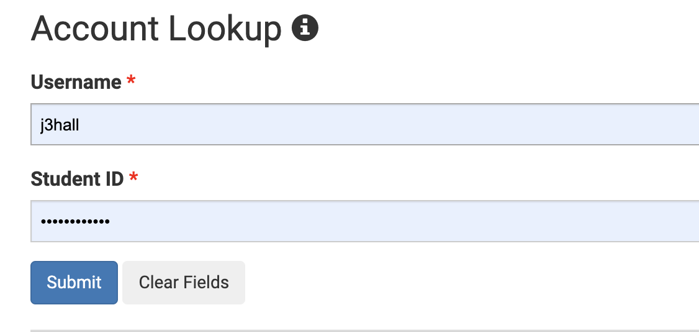 <br />
Enter your username and PID to find your account, there should be a little button with your CSE 15L username beginning with "cs15lwi23" and ending with a combination of 3 letters. 
<br />
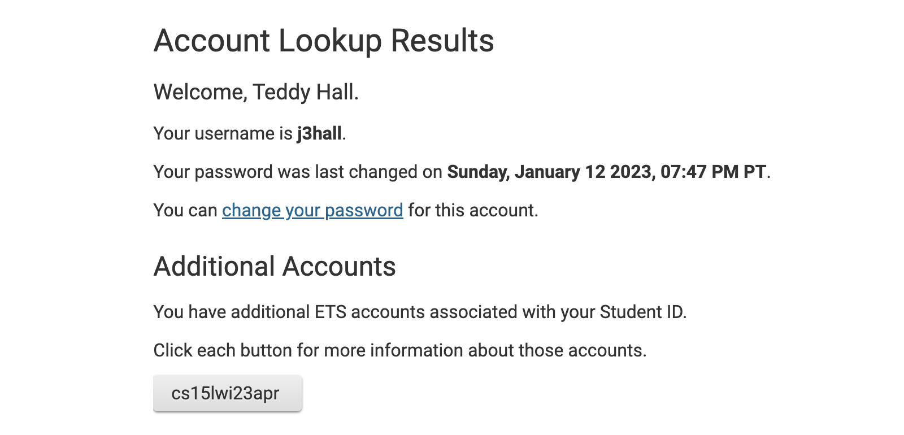 <br />
To set up your account you'll need to use the [password reset](https://sdacs.ucsd.edu/~icc/password.php) and log in again with your username and PID. When resetting your password, you'll have the option to reset all passwords or only course specific passwords. For the purpose of this lab, it is only necessary to reset the course specifc password associated with the "cs15lwi23" account. 
<br />
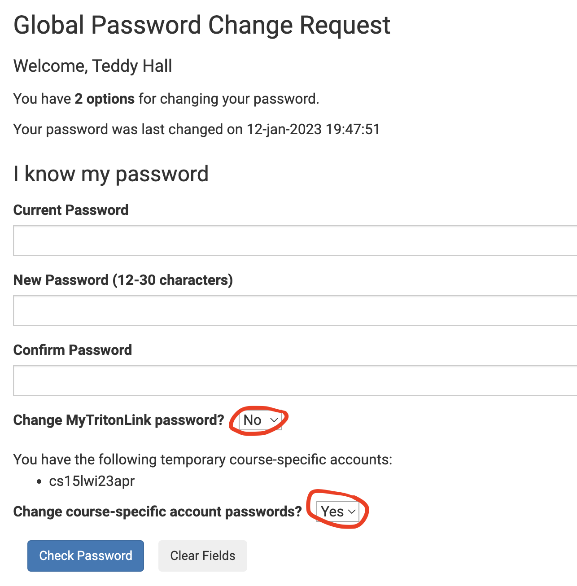 <br />
Once you have set that password, allow up to 15 minutes for the changes to go into effect. 
## Connecting to the CSE Basement
Returning to the opened terminal in VS Code, we want to enter into the terminal (replacing xyz with the corresponding letters in your username):
```
ssh cs15lwi23xyz@ieng6.ucsd.edu
```
If it is your first time logging in, you will probably recieve the following message:
```
The authenticity of host 'ieng6-202.ucsd.edu (128.54.70.227)' can't be established.
RSA key fingerprint is SHA256:ksruYwhnYH+sySHnHAtLUHngrPEyZTDl/1x99wUQcec.
Are you sure you want to continue connecting (yes/no/[fingerprint])? 
```
Enter yes and when prompted, enter your password. Your terminal should look like this now:
```
Hello cs15lwi23xyz, you are currently logged into ieng6-203.ucsd.edu

You are using 0% CPU on this system

Cluster Status 
Hostname     Time    #Users  Load  Averages  
ieng6-201   15:40:01   27  0.20,  0.10,  0.11
ieng6-202   15:40:01   21  0.00,  0.03,  0.05
ieng6-203   15:40:01   17  0.00,  0.05,  0.10

 
Mon Jan 16, 2023  3:44pm - Prepping cs15lwi23
```
## Testing things out
Now that you're connected, it's time to start testing out commands. 
Some common commands are `cd` - change directory, `ls` - list, `pwd` - print working directory, `mkdir` - make directory, and `cp` - copy
<br/><br/>
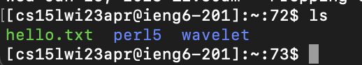
<br/><br />
Here, we can see that the command `ls` displays a list of the files and directories contained within the current directory.
<br /><br /><br />
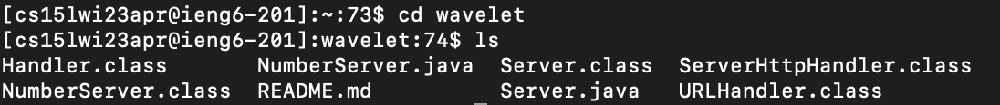 
<br/><br />
Using the `cd` command when followed by name of the directory you would like to switch into allows you to change directories, which in this case is "wavelet". Using the `ls` command once again demonstrates the change in directory by showing the contents of the new directory.
<br /><br /><br />
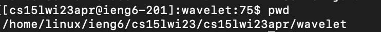 
<br/><br />
This command, `pwd`, means print working directory and it shows the path to the directory in which you are currently located.
<br/><br /><br />
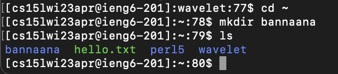 
<br/><br />
In the first line `cd` is used to change back to the home directory that can be represented by using the `~` symbol. In the second line, `mkdir` creates a new directory which is then named with the second argument `bannaana`. The last command run in this photo is `ls` to demonstrate the new directory "bannaana" that has been created within the current directory.

## Finishing
Once you're done testing things out, simply enter `exit` into the terminal to terminate your connection with the remote server and you will recieve the following message:
```
logout
Connection to ieng6.ucsd.edu closed.
```
